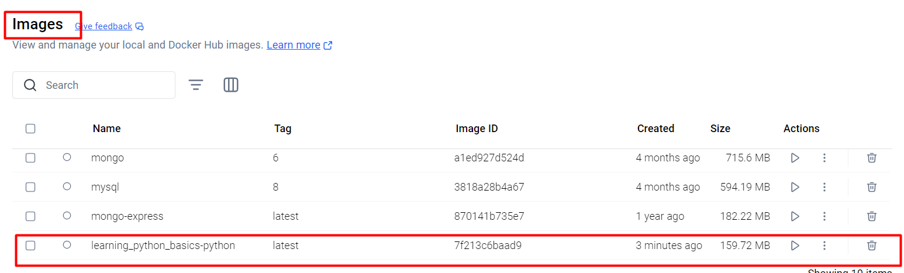

# Learning Python Basics
Python Library for Basic Learning. The purpose of this repo is to learn teh basics of Python programming. I'll be using Docker to run teh code. So that means no Python or package installations. All we need is Docker. You can check this repor [Docker Learning](https://github.com/kashifumar/learning_docker) to install Docker. There are links in teh repo if you would like to learn more of Docker. For now, all you need to know is that Docker wil help us from running any code from our system without worrying about the OS and needing any installations in our system to get working.

### Setup Your Project Structure:
learning_python_basics\
├── Dockerfile\
├── compose.yml\
├── requirements.txt  # Optional, for Python dependencies\
└── code/             # Your local directory for Python scripts\

### Using Docker:
+ Start Docker Desktop\

+ Click Terminal in the right bottom corner to start the terminal\

+ Change to the working directory which in this case is learning_python_basics\

+ Type and Enter docker init to initialize docker settings\

+ You will see a host of options. It does not matter much at this moment whihc option you select. But still select Python\

+ For now, the main purpose of this is for you to get the idea of the options\

+ And as a result some new files are created in the folder\
\

I have copied the files in the folder docker_init_files for your reference. We are using our own settings in these files and even for those settings we are not going into too much details as our purpose here is to learn Python and we are using Docker as a helping tool. You either already know Docker or you shoudl refere to my  [Docker Learning Repo](https://github.com/kashifumar/learning_docker). I have replaced the settings in compose.yaml and Dockerfile with my own settings. The description of the settings is in those file as comments

## Build and Run the Container:

### Build the Docker image:
`docker-compose build`

### Start the container:\
`docker-compose up -d`\
`docker compose up --watch`\

## Access the Python Environment:
+ Click the Container Name\

+ Click Exec\

### ls (displays the directory listing)      
> code  images  requirements.txt
### cd code (changes to code directory)
### ls (displays the directory listing)
> 01_print.py
### python3 01_print.py (runs the python script)
> 11 

### Open an interactive Python shell inside the container:
`docker exec -it python_learning python3`

### Or run specific scripts from the code/ directory:
`docker exec -it python_learning python3 /app/your_script.py`
`docker exec -it python_learning python3 /app/quiz_game.py`

## Stopping the Environment:

+ Stop the container when done:
`docker-compose down`